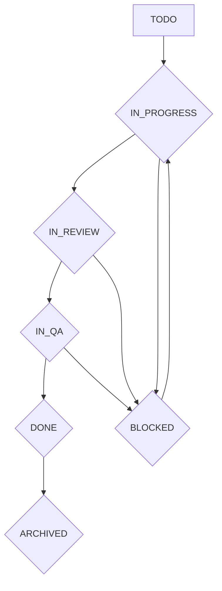

## Task State Definitions

*   **TODO**: The task is defined but work has not yet started.
*   **IN_PROGRESS**: Work on the task has actively begun.
*   **IN_REVIEW**: The task's implementation is complete and is awaiting code review.
*   **IN_QA**: The task has passed code review and is now undergoing Quality Assurance testing.
*   **DONE**: The task has successfully passed all QA and is considered complete.
*   **BLOCKED**: Progress on the task is halted due to an external dependency or issue.
*   **ARCHIVED**: The task is no longer relevant or has been superseded.
